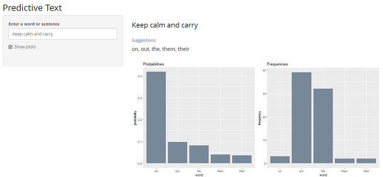

Predictive Text
========================================================
author: Evelyn Baskaradas
date: 4 September 2017
autosize: true
font-family: "Palatino Linotype", "Book Antiqua", Palatino, serif

<small>Capstone Project  
Data Science Specialization  
by Johns Hopkins University on Coursera</small>

Introduction
========================================================
type: custom

Predictive text is input technology used in assisting mobile users with typing messages or notes on their devices by providing a small number of word suggestions that may reasonably fit into the context of a given sentence or phrase.

The Predictive Text Application delivers this functionality based on corpora collected from publicly available sources by a web crawler. The corpora is sourced from the [Capstone Dataset Coursera site](https://d396qusza40orc.cloudfront.net/dsscapstone/dataset/Coursera-SwiftKey.zip), with focus on the **en_US** locale (English - United States). 

Text is sourced from blogs, news, and twitter combined, and is partitioned for training (70%) and test (30%) sets. A 10% validation set is further partitioned from the training set. The prediction model is built on the training set.

<table>
 <thead>
  <tr>
   <th style="text-align:left;"> File </th>
   <th style="text-align:center;"> Lines </th>
   <th style="text-align:center;"> Words </th>
   <th style="text-align:center;"> Longest Line Length </th>
   <th style="text-align:center;"> Ave Char/Line </th>
  </tr>
 </thead>
<tbody>
  <tr>
   <td style="text-align:left;"> Training </td>
   <td style="text-align:center;"> 268,989 </td>
   <td style="text-align:center;"> 6,419,496 </td>
   <td style="text-align:center;"> 4,491 </td>
   <td style="text-align:center;"> 133 </td>
  </tr>
</tbody>
</table>

Kneser-Ney Smoothing
========================================================
type: custom

This application employs the **Kneser-Ney smoothing** algorithm to calculate the probability distribution of n-grams in a corpus based on their histories. It is  fundamentally a backoff smoothing algorithm, modified to exclude unseen higher-order n-grams when backing off and calculating the lower-order probability.

Take, for example, the common bigram example of "San Francisco" which may appear many times in a training corpus. As such, the unigram frequency "Francisco" occurs relatively often, though mostly following the word "San". Kneser-Ney smoothing considers the frequency of "Francisco" in relation to its possible preceeding words.

$$P_{KN}(Francisco) = \frac{N_{1+}(\bullet Francisco)}{N_{1+}(\bullet \bullet)} = \frac{c\ (Francisco)}{\sum_{w_i}c\ (w_i)}$$

$$P_{KN}(Francisco|San) = \frac{max\{c\ (San Francisco) - D,\ 0\}}{c\ (San)} + \frac{D}{c\ (San)}N_{1+}(San\bullet)P_{KN}(Francisco)$$ The discount value, <i>D</i>, is estimated based on the total number of n-grams occuring exactly once and twice. $$D = \frac{n_1}{n_1 + 2n_2}$$

The Application
========================================================
type: custom

The application takes in an input of any length and provides the top 5 predictions based on the context of the last quadgrams to bigrams depending on the observation matches in the dictionary. 

The default base for predictions is quadgrams, supplemented by predictions from trigrams and bigrams if the default is unable to provide all 5 predictions.

If no results are returned, skip-1 and skip-2 bigrams are utilized.

The user may also choose to view the predictions by n-gram probability distributions and compare them with raw frequency counts of word occurances in the dictionary.

Try the Application
========================================================
type: custom

The accuracy of the model was evaluated using the [Next Word Prediction Benchmark](https://github.com/hfoffani/dsci-benchmark) tool*. 

While performing at an acceptable level, future enhancements will include explorations into further trimming the dictionary as well as considerations for the inclusion or exclusion of stop words.

The **Predictive Text** application is a useful interactive tool which enables users, particularly of mobile devices, to construct text messages or notes quickly and with ease.

<a href = "https://evelynb7.shinyapps.io/nextword/", target = "_blank">Get the app!</a>

* R script as modified by H. Foffani (accessed 27 August 2017)

<b>Resources:</b>   

[1] Wikipedia, <a href =  "https://en.wikipedia.org/wiki/Kneser-Ney_smoothing", target = "_blank">Kneser-Ney smoothing</a> 
[2] M.C. K&ouml;rner,
<a href =  "https://west.uni-koblenz.de/sites/default/files/BachelorArbeit_MartinKoerner.pdf", target = "_blank">Implementation of Modified Kneser-Ney Smoothing on Top of Generalized Language Models for Next Word Prediction</a> 
[3] S. F. Chen and J. Goodman, <a href = "https://people.eecs.berkeley.edu/~klein/cs294-5/chen_goodman.pdf", target = "_blank">An Empirical Study of Smoothing Techniques for Language Modeling</a> 
[4] J. Gauthier, <a href = "http://www.foldl.me/2014/kneser-ney-smoothing/", target = "_blank">Kneser-Ney smoothing explained</a> 
[5] S. Milli, <a href = "http://smithamilli.com/blog/kneser-ney/", target = "_blank">Kneser-Ney Smoothing</a>

