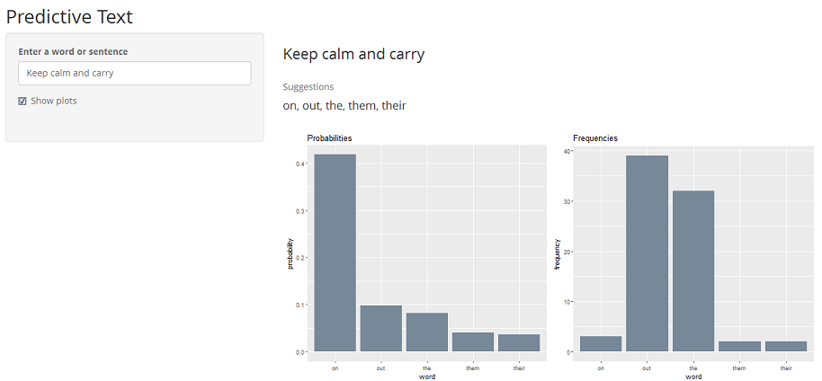

```{r setup, include=FALSE}
knitr::opts_chunk$set(echo = TRUE)
#library(ggplot2)
```

<div style= "float:right;position: relative; top: -10px;">
```{r echo=FALSE, out.width='100%'}

```
</div>

Predictive text is input technology used in assisting mobile users with typing messages or notes on their devices by providing a small number of word suggestions that may reasonably fit into the context of a given sentence or phrase. 

As more people are spending increasing amounts of time on their mobile devices for email, social networking, banking and a whole range of other activities, predictive text helps by significantly increasing the speed of these transactions as well as providing enhanced typing experience. 


## The Application

The application takes in an input of any length and provides the top 5 predictions based on the context of the last 3 to 1 words depending on the observation matches in the dictionary. The default base for predictions is the last 3 words of the input, supplemented by predictions from the last 2 and 1 if the default is unable to provide all 5 predictions.

The user may also choose to view the predictions by context probabilities and compare them with raw frequency counts of word occurances in the dictionary. For the input "<b >Keep calm and carry</b>" in the example below, the top prediction is "<b>on</b>" by probability. The outcome contrasts with the prediction of "<b>out</b>" if simple frequency counts were used instead.

As suggested by the prediction model, "<b>Keep calm and carry <i>on</i></b>" is a more commonly constructed phrase than "<b>Keep calm and carry <i>out</i></b>" even though "<b>on</b>" occurs less frequently in the dictionary.

</br>

<div style= "float:center;position: relative; top: -10px;">
```{r echo=FALSE, out.width='100%'}

```
</div>